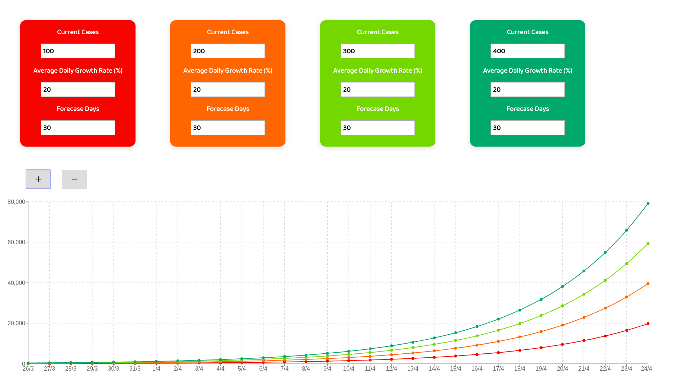

# CovidForcaster: Covid-19 Cases Prediction Web App

## Overview

CovidForecaster is a React web app for predicting future Covid-19 cases based on the current number of cases and current average daily case growth rate.

The purpose of CovidForcaster is to predict the future number of Covid-19 cases in a particular country. The spreading of diseases follows an exponential curve which can be counterintuitive. Fortunately, mathematical and graphical tools can make exponential growth easier to understand.

Graphing and forecasting can be done via programming languages such as R. However, expertise is required to do this. CovidForcaster was created to enable anyone to forecast future cases of Covid-19 or any other infectious disease.

## Installation

1. download and extract the repository.
2. run `yarn`
3. run `yarn start`
4. open `http://localhost:3000` to view the app.

## Technologies

- ReactJS
- React library for graph: Recharts
- Javascript

# How It Works

CovidForcaster relies on three pieces of information to create predictions:

- the current number of cases in a given country (eg. 100)
- the projected daily case growth rate (eg. 0.2 which means 20%)
- the length of the forecast (currently limited to a range of 1 to 10 days)

The exponential forecast equation is:

- y = (current_cases) x (1 + daily_growth_rate) ^ forecast_length
- eg. y = 100 x 1.2 ^ 25
- x is a list of days from 0 representing today to the final day of the forecast. Dates are displayed on the x-axis.
- the output is the number of projected cases and is shown on the y-axis.

### Limitations of the Model

Factors that are not taken into account by the model:

- government response: patient closing of schools, shops and businesses.
- population density in a country.
- wealth of a country etc.

# Disclaimer

It's said that "all models are wrong but some are useful".

Predicting the future with perfect accuracy is almost impossible and all of CovidForecaster's predictions are wrong to some degree (take them with a grain of salt).

This app is not a replacement for expert opinion.
